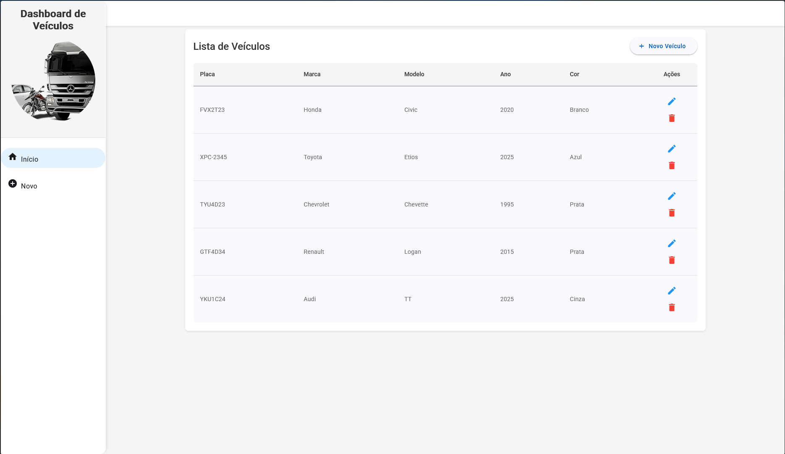
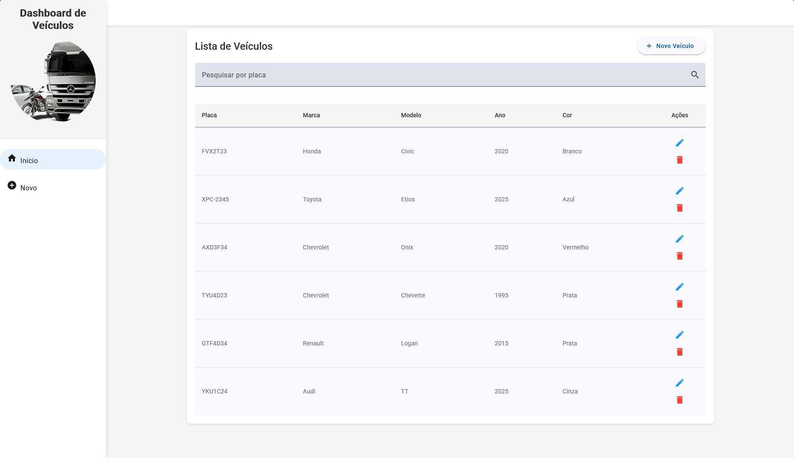
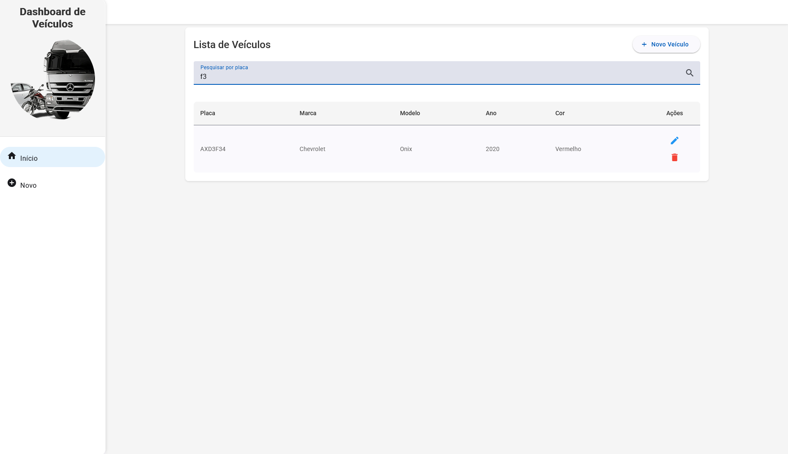
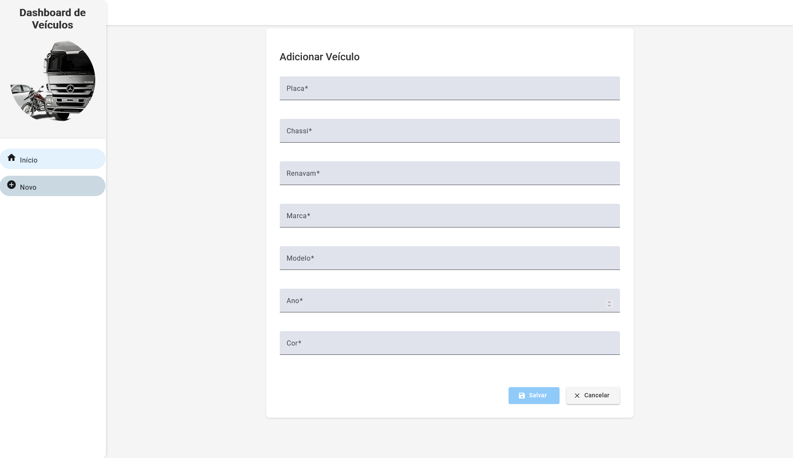
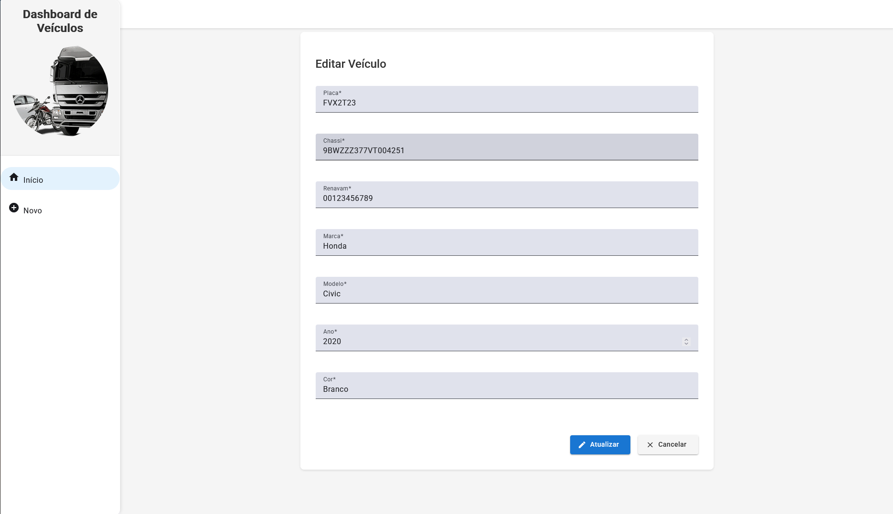
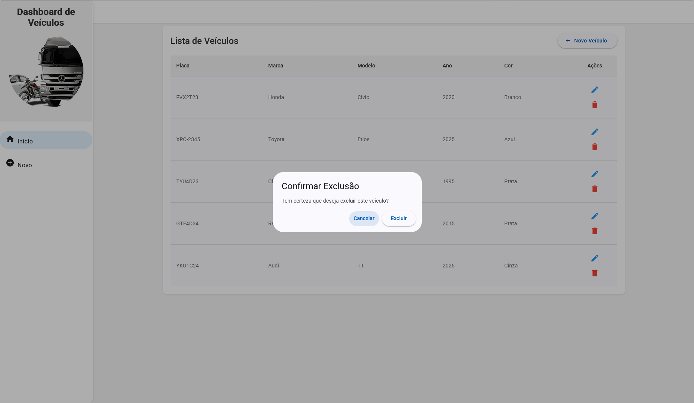

# Desafio Frontend - Info Sistemas

Este projeto foi desenvolvido como parte do processo seletivo para a vaga de Desenvolvedor Frontend na [Info Sistemas](https://www.infosistemas.com.br/).

## 📋 Sobre o Desafio

O desafio consistia em desenvolver uma aplicação web para gerenciamento de veículos, utilizando Angular 16+ e seguindo as melhores práticas de desenvolvimento. Os requisitos principais eram:

- Criar projeto front-end utilizando Angular 16+
- Criar lista de veículos
- Disponibilizar projeto no GitHub

A aplicação deveria permitir o gerenciamento de veículos com os seguintes atributos:

- ID
- Placa
- Chassi
- Renavam
- Modelo
- Marca
- Ano

Como funcionalidade extra, foi implementada uma pesquisa por placa que aparece automaticamente quando há 6 ou mais veículos cadastrados.

## 🛠️ Tecnologias Utilizadas

- Angular 19.2.7
- Angular Material
- TypeScript
- SCSS
- RxJS
- Figma

## 📸 Screenshots da Aplicação

### Lista de Veículos (Sem Pesquisa)



### Lista de Veículos (Com Campo de Pesquisa)



### Pesquisando Veículos



### Cadastro de Novo Veículo



### Edição de Veículo



### Confirmação de Exclusão



## 🚀 Funcionalidades Implementadas

### Validação de Placa

- Suporte aos padrões Mercosul e antigo
- Formato Mercosul: AAA 1A34 (3 letras + 1 número + 1 letra + 2 números)
- Formato Antigo: AAA 1234 (3 letras + 4 números)
- Exclusão das letras I, O e Q conforme especificação

### Pesquisa

- Campo de pesquisa aparece automaticamente quando há 6 ou mais veículos
- Busca em tempo real por placa
- Case-insensitive (não diferencia maiúsculas de minúsculas)
- Debounce de 300ms para otimização de performance

### Interface

- Design responsivo e moderno
- Feedback visual para ações do usuário
- Confirmação antes de excluir veículos
- Validação de formulários
- Mensagens de erro claras e informativas

## 🚀 Como Executar o Projeto

### Pré-requisitos

- Node.js (versão 18 ou superior)
- npm ou yarn

### Instalação

```bash
# Clone o repositório
git clone https://github.com/seu-usuario/infosys-frontend-challenge.git

# Entre no diretório do projeto
cd infosys-frontend-challenge

# Instale as dependências
npm install
```

### Desenvolvimento

```bash
# Inicie o servidor de desenvolvimento
ng serve

# Acesse http://localhost:4200 no navegador
```

### Build

```bash
# Gere a build de produção
ng build
```

## 📝 Pull Requests

### PR #1: [Criação da Estrutura Base](https://github.com/deverebor/infosys-frontend-challenge/pull/1)

- Adição da estrutura base dos componentes
- Adição da estrutura base dos modelos
- Adição da estrutura base do serviço mock
- Validações nos campos do formulário
- Campos do formulário completos (sem estilização inicial)

### PR #2: [Melhorias no Formulário e Sidebar](https://github.com/deverebor/infosys-frontend-challenge/pull/2)

- Adição do Figma como referência de layout
- Criação do componente de sidebar para melhorar a navegação
- Implementação do armazenamento em localStorage para simular persistência de dados
- Nova estilização e estrutura do formulário de veículos

### PR #3: [Estilização da Lista de Veículos](https://github.com/deverebor/infosys-frontend-challenge/pull/3)

- Ajuste da estrutura e estilização da lista de veículos
- Criação do componente de diálogo para confirmação de exclusão

### PR #4: [Implementação da Pesquisa e Ajuste nas Placas](https://github.com/deverebor/infosys-frontend-challenge/pull/4)

- Ajuste das placas para atender ao padrão atual do Brasil (Mercosul e antigo)
- Adição da funcionalidade de pesquisa nos veículos armazenados

## 🤝 Contribuição

Este projeto foi desenvolvido como parte de um desafio técnico. Para contribuições, por favor, abra uma issue ou pull request.

## 🙏 Agradecimentos

Agradeço à Info Sistemas pela oportunidade de participar deste desafio e pela experiência de desenvolvimento proporcionada.

---

Feito com ❤️ por [Lucas Souza (deverebor)](https://github.com/deverebor)
